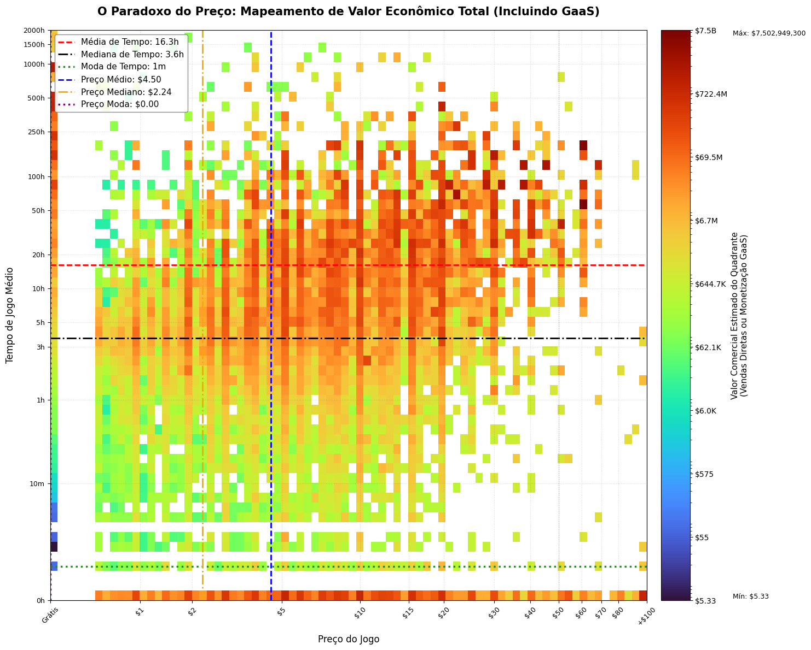

# Relatório

> [!CAUTION]
>
> - Você <ins>**não pode utilizar ferramentas de IA para escrever este relatório**</ins>.

## Identificação

- **Nome**: <mark>`<Henrique Wermann da Silva>`</mark>
- **Cartão UFRGS:** <mark>`<00588786>`</mark>

## Dados utilizados

> [!IMPORTANT]
>
> - Os dados utilizados devem ser informados como **links** para as fontes originais.
> - Se houver mais de um conjunto de dados, liste todos separadamente.
> - Para cada conjunto de dados, inclua também uma **descrição curta** explicando os dados.

1. **Dataset 1**: <mark>`<https://www.kaggle.com/datasets/fronkongames/steam-games-dataset/data>`</mark>
    * **Descrição curta**: <mark>`<Conjunto de dados de jogos da Steam. Alguns dos campos são número de vendas, data de lançamento, tempo médio por usuário, gênero do jogo entre outros.>`</mark>
2. **Dataset 2**: <mark>`<link>`</mark>
    * **Descrição curta**: <mark>`<preencher>`</mark>
3. ...

## Código-fonte da visualização

> [!IMPORTANT]
>
> - Indique abaixo onde está, dentro deste repositório, o código-fonte usado para gerar a visualização.

- **Arquivo principal**: <mark>`<lab3compgrafica.ipynb>`</mark>
- **Observação**: <mark>`<O notebook da implementação possui mais de uma célula com gráficos, que foram usados para compreensão dos dados coletados e testes com visualizações diferentes, para aprendizado. A célula que fornece a imagem utilizada para a analise é a última. >`</mark>

## Imagem da visualização gerada

> [!IMPORTANT]
>
> - Insira aqui uma imagem da visualização criada por você. Troque `imagem-da-visualizacao.png` pelo caminho correto do arquivo no repositório. 
> - Se você criou alguma visualização interativa, então descreva aqui como acessá-la. Por exemplo, se for uma página HTML, coloque o link, ou se for uma visualização 3D, descreva como compilar e executar o código. 

<mark>`<preencher abaixo>`</mark>

## Descrição da visualização

### Legenda (*caption*)

> [!IMPORTANT]
>
> - Escreva um texto curto explicando como interpretar a visualização. Descreva os elementos visuais, eixos, cores, símbolos ou interações relevantes.
> - Este texto seria a legenda (*caption*) que acompanharia a figura em uma publicação, por exemplo.

<mark>`<eixo X: distribuição dos jogos pelo preço

eixo Y: distribuição dos jogos por número médio de horas jogadas

Cores: faturamento estimado considerando o número de vendas x preço para jogos pagos em jogos não gratuitos, e número de vendas x número médio de horas x $0.03 (valor estimado de arrecadação por hora em jogos free-to-play) em jogos grátis.
Em suma, quanto mais próximo do vermelho escuro está um quadrado, maior a areecadação estimada dos jogos daquela faixa de preço com aquele tempo médio de jogo>`</mark>

### Conclusão demonstrada pela visualização

> [!IMPORTANT]
>
> - Escreva uma conclusão curta sobre os dados com base na visualização.
> - Explique qual insight, padrão ou tendência pode ser observado.

<mark>`<Conclusão 1: Jogos que tem uma média de tempo de jogo por jogador baixissima, menor que dez minutos, geram muito dinheiro, o que é contra intuitivo. Como pode ser visto com a linha mais baixa da tabela com cores avermelhadas.

Conclusão 2: Jogos gratuitos com muitas horas de jogo geram mais retorno que jogos pagos com a mesma média de tempo por jogador. considerando que jogos free-to-play ganham em média $0.008 por hora que um jogador passa no jogo, muitos jogos grátis tem grandes bases de jogadores que passam muito tempo no jogo, fazendo eles darem bastante retorno quando comparados aos jogos pagos da mesma faixa de tempo médio por jogador. Isso pode ser observado, olhando para a coluna mais a esquerda a partir das 100 horas médias e comparando seus valores na mesma linha.>`</mark>
